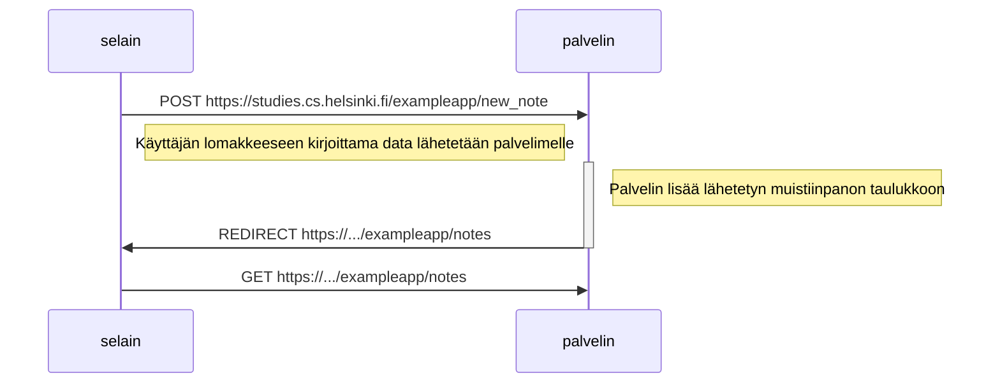

```mermaid
sequenceDiagram
  participant selain
  participant palvelin
  
  selain->>palvelin: POST https://studies.cs.helsinki.fi/exampleapp/new_note
  note right of selain: Käyttäjän lomakkeeseen kirjoittama data lähetetään palvelimelle
  activate palvelin
  Note right of palvelin: Palvelin lisää lähetetyn muistiinpanon taulukkoon
  palvelin->>selain: REDIRECT https://.../exampleapp/notes
  deactivate palvelin
  selain->>palvelin: GET https://.../exampleapp/notes
```
Ja jatko kuin materiaalissa esitetyssä GET pyynnön kaaviossa.
