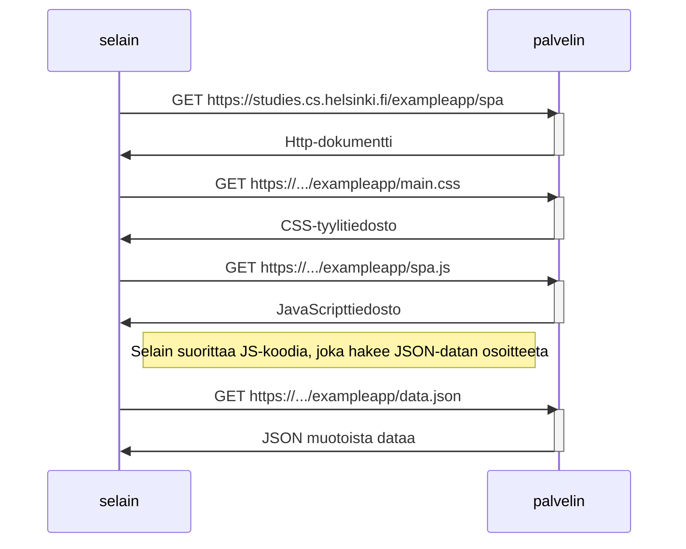

```mermaid
sequenceDiagram
  participant selain
  participant palvelin

  selain ->> palvelin: GET https://studies.cs.helsinki.fi/exampleapp/spa
  activate palvelin
  palvelin->>selain: Http-dokumentti
  deactivate palvelin
  selain ->> palvelin: GET https://.../exampleapp/main.css
  activate palvelin
  palvelin ->> selain: CSS-tyylitiedosto
  deactivate palvelin
  selain ->> palvelin: GET https://.../exampleapp/spa.js
  activate palvelin
  palvelin ->> selain: JavaScripttiedosto
  deactivate palvelin
  Note right of selain: Selain suorittaa JS-koodia, joka hakee JSON-datan osoitteeta
  selain ->> palvelin: GET https://.../exampleapp/data.json
  activate palvelin
  palvelin ->> selain: JSON muotoista dataa
  deactivate palvelin
```
