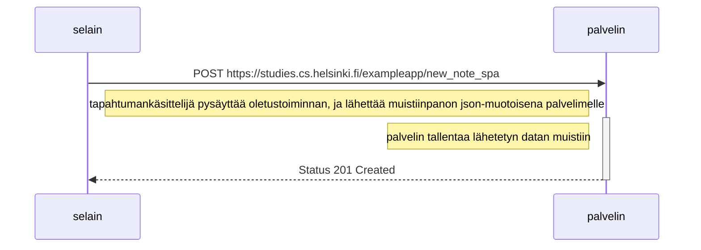

```mermaid
sequenceDiagram 
  participant selain
  participant palvelin

  selain ->>palvelin: POST https://studies.cs.helsinki.fi/exampleapp/new_note_spa
  Note right of selain: tapahtumankäsittelijä pysäyttää oletustoiminnan, ja lähettää muistiinpanon json-muotoisena palvelimelle
  activate palvelin
  Note left of palvelin: palvelin tallentaa lähetetyn datan muistiin
  palvelin -->> selain: Status 201 Created
  deactivate palvelin
```
